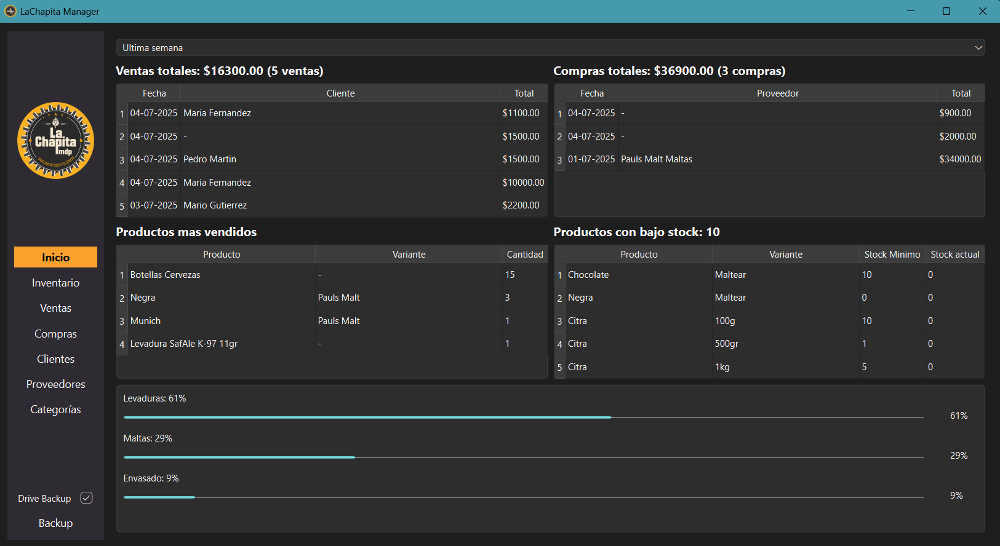
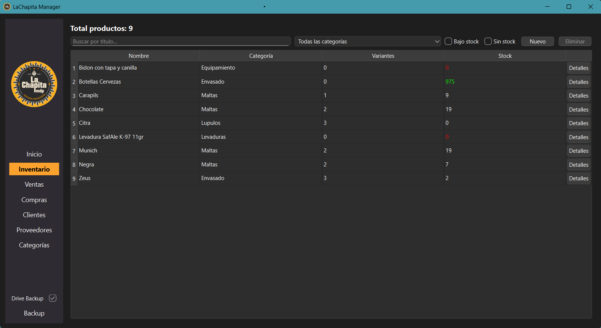
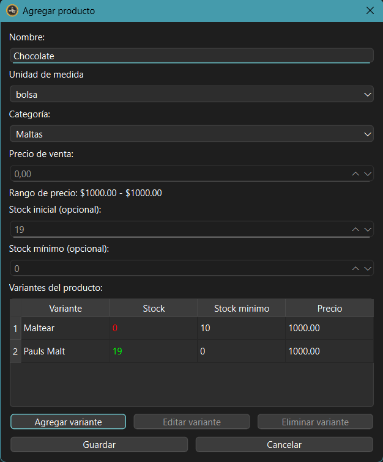
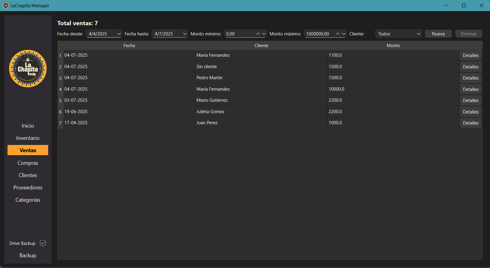
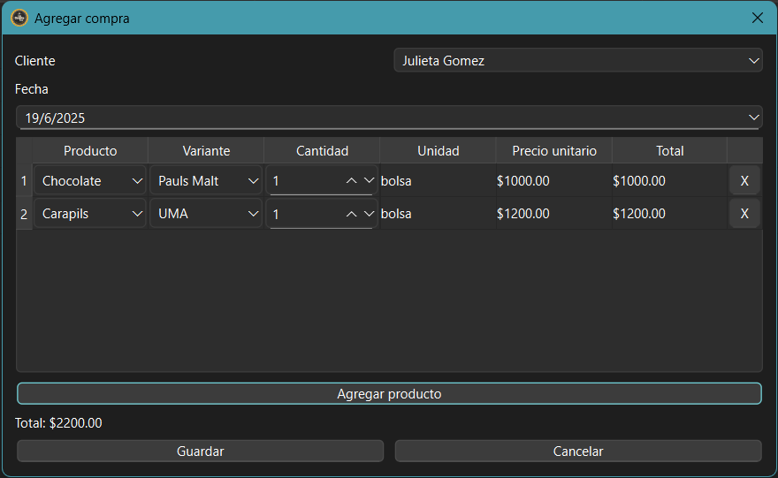

# LaChapitaManager


LaChapitaManager is a desktop inventory and sales management application designed for small businesses, specifically tailored for a craft brewing supplies store. It helps manage stock levels, register purchases and sales, generate insightful reports, and track product performance over time.

The application is developed in **Python** using **PySide6** for the graphical user interface. All data is stored locally in a **SQLite** database. The system supports both **local backups** and **optional Google Drive integration** for cloud-based backups, giving users flexibility in how they protect their data

## Features

- **Inventory Management:** Add, edit, and delete products with detailed information and categorization.
- **Sales and Purchases Tracking:** Record sales and purchases while associating them with clients and suppliers.
- **Client and Supplier Management:** Keep track of clients and suppliers, linking them to respective transactions.
- **Dashboard Overview:** Home page includes key metrics like total sales, purchases, top-selling products, and a table highlighting products with low or no stock.
- **Reports and Metrics:** Generate insights to monitor business performance over customizable time periods.
- **Backup options:** Choose between local backups or optional Google Drive integration to securely store your data in the cloud
- **User Interface:** Desktop application built with PySide6 featuring an intuitive sidebar navigation for easy access to all sections.

## Installation and Usage

### Installation

1. **Clone the repository** or download the latest release.

2. **Set up the environment (for running from source):**
   
   - Make sure you have Python 3.10 or higher installed.
   - (Optional but recommended) Create and activate a virtual environment:
     
     ```bash
     python -m venv .venv
     source .venv/bin/activate  # Linux/macOS
     .venv\Scripts\activate     # Windows
     ```
   - Install the required dependencies:
     
     ```bash
     pip install -r requirements.txt
     ```

3. **Running the packaged executable:**
   
   - Download the executable for your platform from the `dist` folder.
   - Place it anywhere you want; no installation is needed.
   - Double-click the executable to run the app.

### Usage

- On first run, the app will create the necessary database file (`lachapita.db`) in your user’s AppData (Windows) or equivalent directory on other platforms. This ensures your data is saved in a writable location outside the installation folder.

- The app supports **optional Google Drive backups**. If enabled via the toggle in tha navigation bar, the app will prompt for your Google credentials and create/update a backup file in your configured Google Drive. If the feature is disabled, the system will fall back to **local backups**

- To start the app from source, run:
  
  ```bash
  python desktop/main.py
  ```

- The window will open with the main interface, including inventory management, sales, purchases, and reporting features.

- Any resource files like images or configuration are automatically located using the internal `resource_path` function, so you don't need to worry about paths whether running as source or executable.

## Project Structure

The codebase is organized into clear, functional modules for maintainability and scalability:

```
LaChapitaManager/
├── assets/              # Icons, images, and other static resources used by the UI 
├── build/               # Scripts and files used for building the application
├── db/                   # Database initialization and connection functions
├── desktop/          # Packaged UI app structure
│   ├── ui/               # PySide6 user interface files
│   └── main.py       # Entry point of the application
├── dist/                 # Output folder for the compiled application (after building)
├── models/           # Data access logic (CRUD operations)
├── services/          # Business logic and services
├── utils/                # Utility functions
├── requirements.txt     # Python dependencies
└── README.md            # Project documentation
```

- **`assets/`**: Icons, images, and other static resources used throughout the user interface.
- **`build/`**: Scripts and files used to generate the executable version of the application (e.g., PyInstaller configs).
- **`db/`**: Functions to initialize and connect to the SQLite database.
- **`desktop/`**: Folder used for packaging the app, including UI resources and credentials for backup.
- **`ui/`**: Contains `.ui` files and logic for rendering PySide6 interfaces.
- **`main.py`**: Entry point of the application; launches the main window and initializes the system.
- **`dist/`**: Folder where the final compiled application is placed after building.
- **`models/`**: Handles all database interaction logic.
- **`services/`**: Implements business rules and high-level services.
- **`utils/`**: General-purpose utilities (e.g., file path handling, backup helpers, Google Drive integration).
- **`requirements.txt`**: Lists all Python dependencies.

## Screenshots

### Dashboard / Reports Overview

*Home page showing sales metrics, top products, and low stock alerts.*

### Inventory Management page

*Browse, search, and select products.*

*Add or update product details, including category, variants and stock information*

### Sales Managment

*Overview of all recorded sales with filtering.*

*Interface to input or update details of a sale, including client info and products.*


## Built With

- [Python 3.10+](https://www.python.org/)
- [PySide6 (Qt for Python)](https://doc.qt.io/qtforpython/)
- [SQLite](https://www.sqlite.org/)
- [PyInstaller](https://pyinstaller.org/) – for packaging the app
- Google Drive API (optional backup integration)

## What I Learned

- Building a full-featured desktop application using PySide6 and Python.
- Designing a modular and scalable codebase for maintainability.
- Managing database operations and relationships using SQLite.
- Integrating Google Drive API for optional cloud backups.
- Creating a seamless user experience with a custom-designed UI.

## Roadmap / Future Improvements

- Add user authentication and roles.
- Implement export to CSV or PDF for reports.
- Improve error handling and validation.
- Add unit tests and CI pipeline.

## About Me

I'm a Computer Engineering student at UNMdP, passionate about building useful software solutions.  
This project was created as a way to help manage my family's business and learn real-world development practices.

📧 [maite2003n@gmail.com]  
🔗 [LinkedIn](https://linkedin.com/in/maite-nigro/)
